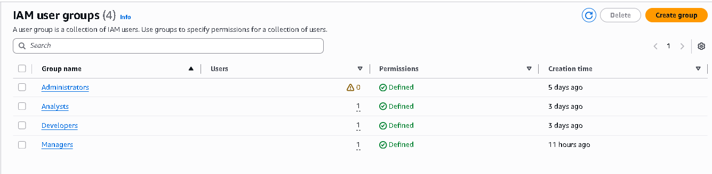
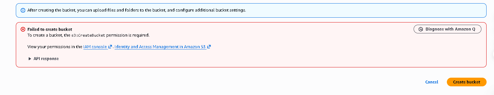
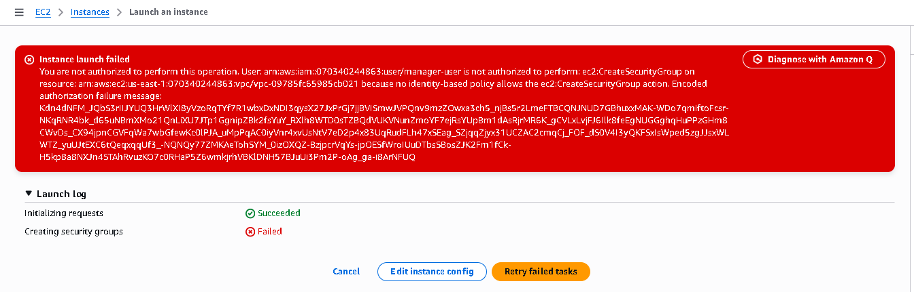
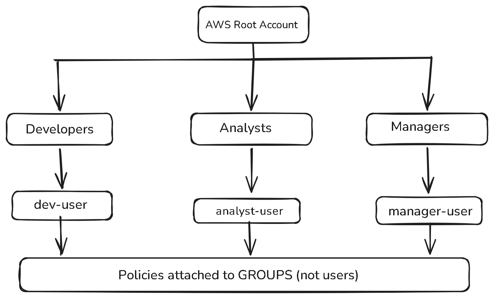
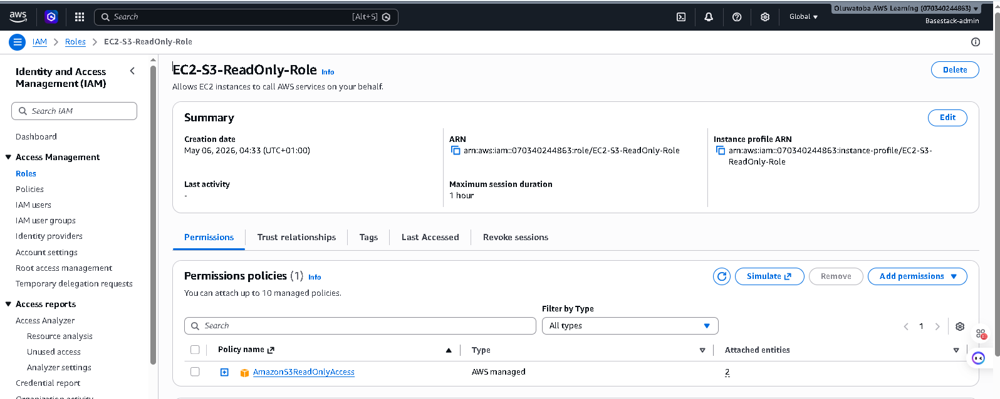

# AWS IAM Security Setup Project

## Overview

This project demonstrates a secure AWS Identity and Access Management (IAM) configuration that follows industry best practices, such as Role-Based Access Control (RBAC) and the Principle of Least Privilege.

---

## Architecture Design

* AWS Root Account (secured and restricted)
* IAM Groups:

  * Developers
  * Analysts
  * Managers
* IAM Users assigned to groups
* Policies attached to groups (not users)
* IAM Role for EC2 to securely access S3

---

##  Security Features Implemented

* Role-Based Access Control (RBAC)
* Least Privilege Principle
* Group-based policy management
* Access restriction validation using real-world scenarios
* IAM Roles for service-to-service authentication

---

##  Project Evidence

### IAM Groups with Policies

### Analyst Access Denied (S3 Bucket Creation)

### Manager Access Denied (EC2 Launch)

### IAM Architecture Diagram

### EC2-S3 ReadOnly Role

---

##  Key Learnings

* Structured IAM using groups instead of assigning permissions directly to users
* Enforced access restrictions using policies
* Validated security configuration through access denial testing
* Implemented IAM roles for secure AWS service interaction

---

## Tools & Services Used

* AWS IAM
* Amazon EC2
* Amazon S3
* Excalidraw (for architecture diagram)

---

##  Project Goal

To design and implement a secure and scalable IAM architecture that aligns with real-world cloud security standards.
